# Ling-Shu（灵数）

[English](README.md)

Ling-Shu 是一个企业级 ChatBI / Text2SQL / VoiceBI 平台。用户可以用自然语言向企业数据库提问，系统通过 ReAct Agent 循环完成任务规划、数据源路由、SQL 生成、安全审核、查询执行、结果汇总和图表展示，并支持流式 ASR/TTS 语音交互。

后端围绕自然语言问数主链路做模块化组织：项目管理、数据源插件、元数据同步、RAG、ReAct Agent 执行、权限、审计、ASR 和 TTS 等能力都放在 `internal/` 下，便于按功能持续演进。

## Web 管理台

### 对话问数与 ReAct 结果观察

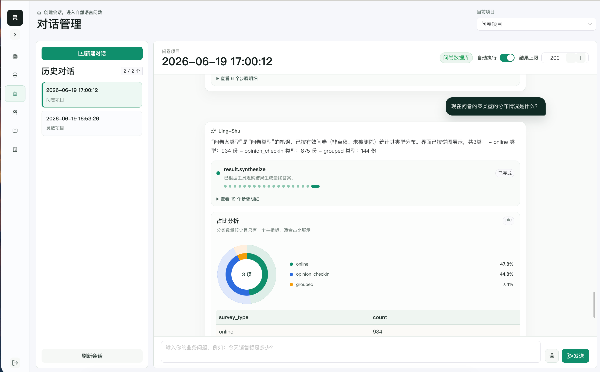

### 数据源与元数据

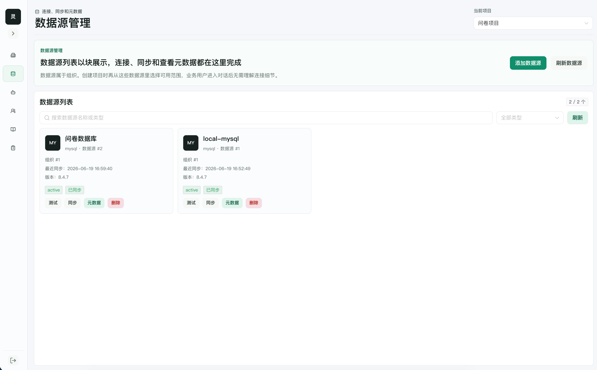

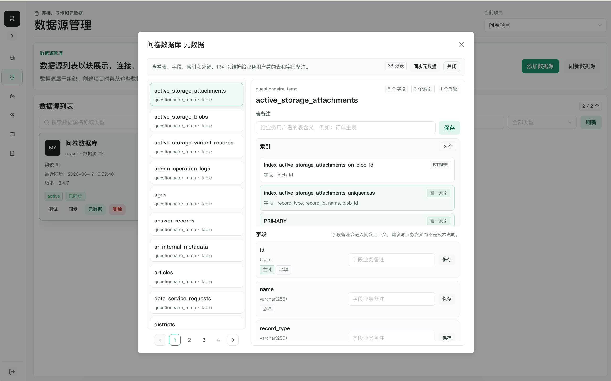

### 项目、成员、知识与审计

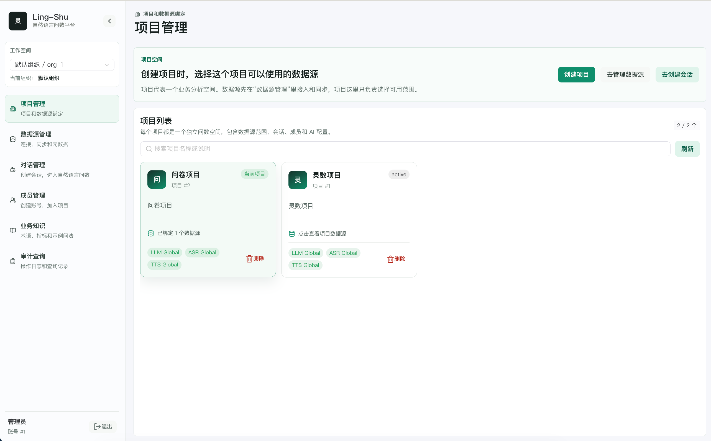

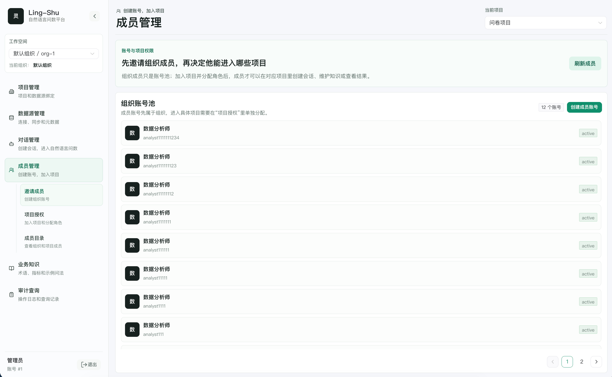

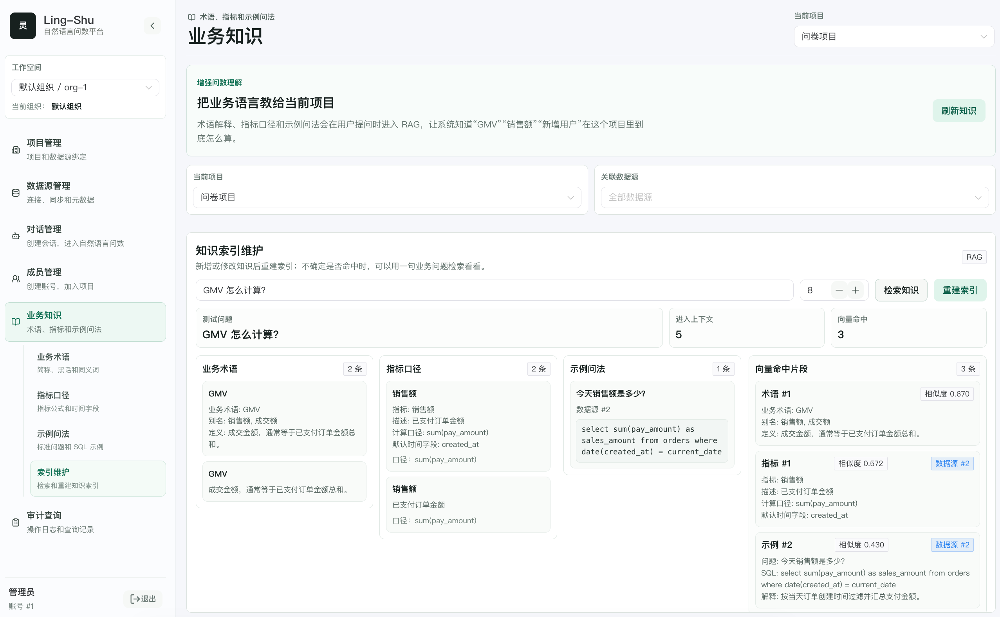

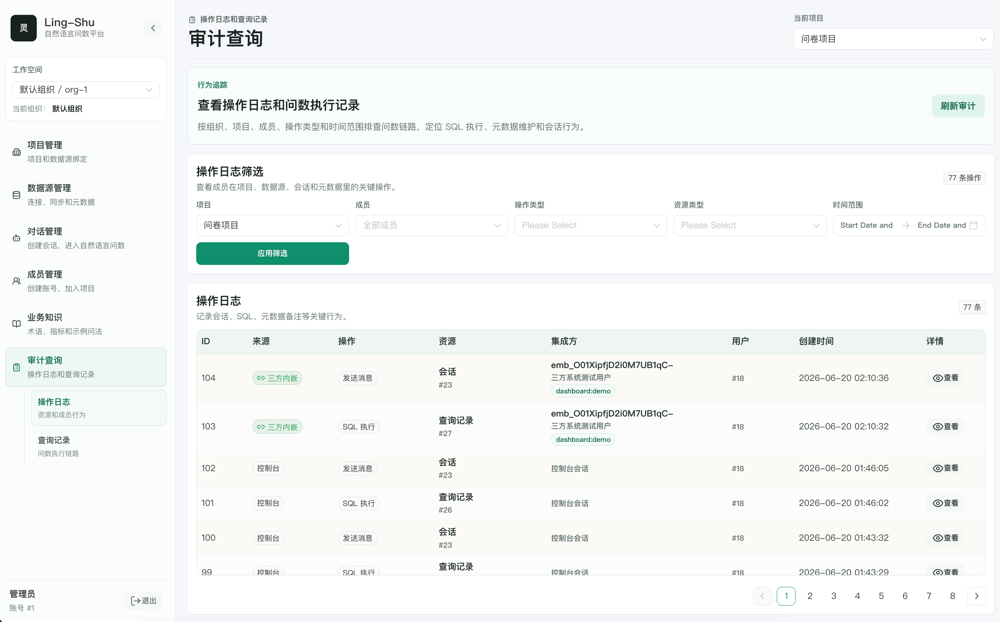

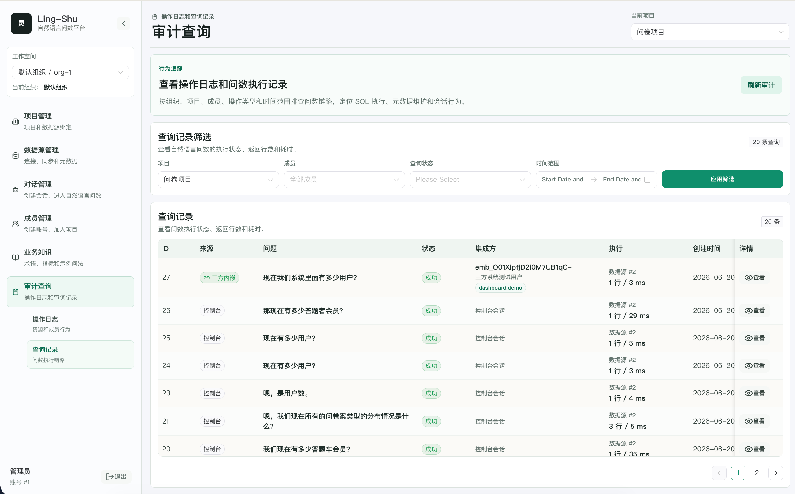

## 核心能力

- 自然语言问数，采用 ReAct Agent 方式循环完成用户任务。
- 多租户模型：Tenant -> Project -> DataSource。
- 项目级多数据源问答，支持跨数据源查询结果汇总与综合回答。
- SQL 安全审核：仅允许 SELECT，禁止写入和 DDL，支持结果行数限制、超时控制和审计记录。
- 元数据同步：Schema、Table、Column、Index、PrimaryKey、ForeignKey。
- 业务知识 RAG：业务术语、指标口径、FewShot SQL。
- LLM / ASR / TTS Provider 化，目前重点适配阿里云。
- VoiceBI：流式 ASR 输入和流式 TTS 播放。
- 第三方系统内嵌：项目可创建 Embed App，第三方页面通过轻量 JS SDK 出现悬浮机器人，并在弹窗 iframe 中完成文本问数和项目级 ASR/TTS 语音交互。
- RBAC 权限角色：SuperAdmin、TenantAdmin、ProjectAdmin、Analyst、Viewer；组织/项目成员支持启用、停用和移除，主管理员受保护。
- Vue 3 + TypeScript + Naive UI 前端管理台。

## 技术栈

- 后端：Go、Gin、GORM、Zap
- 前端：Vue 3、TypeScript、Vite、Naive UI
- 数据库：MySQL 8
- 缓存：Redis
- 向量数据库：Milvus
- AI Provider：阿里云 DashScope / NLS
- 部署：Docker、Docker Compose、Kubernetes

## 系统架构

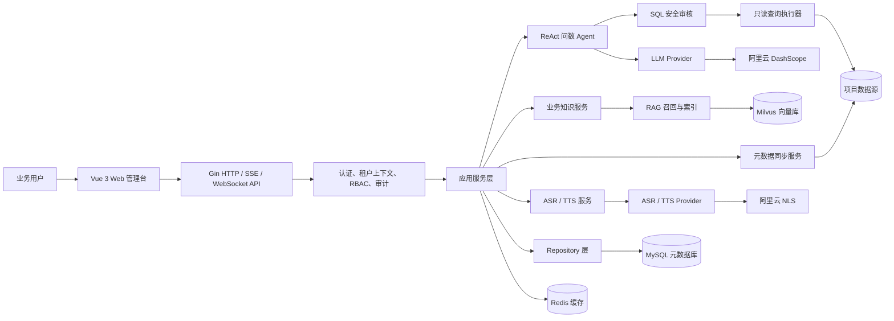

运行时可以分成三个边界：

- **控制面**：租户、用户、项目、数据源绑定、Provider 配置、权限和审计记录保存在 MySQL。
- **知识面**：业务术语、指标口径、FewShot SQL 和文档切片向量化后进入 Milvus，用于项目级 RAG 召回。
- **执行面**：Agent 只能对当前项目绑定的数据源执行通过审核的只读 SQL。

## 数据源支持

当前已接入插件注册机制：

- MySQL
- PostgreSQL
- KingbaseES
- SQL Server
- Oracle
- ClickHouse
- Doris
- 达梦 DM8

## 项目结构

```text
cmd/server/        服务启动入口
configs/           配置示例
docs/              架构与设计文档
frontend/          Vue 3 前端
internal/          业务模块
  aliyun/          阿里云 SDK 集成（如 NLS）
  asr/             ASR Provider
  audit/           审计类型定义
  auth/            密码哈希与 Token 工具
  bootstrap/       服务组装与依赖装配
  cache/           Redis 客户端与分布式锁
  config/          配置加载
  database/        MySQL/GORM 连接
  datasource/      数据源插件与元数据同步
  handler/         HTTP 和实时接口
  llm/             LLM Provider
  middleware/      Gin 中间件
  model/           GORM Model
  query/           ReAct Agent 与 SQL 执行
  rag/             RAG 与 Milvus
  repository/      数据访问层
  router/          路由
  service/         业务服务层
  tts/             TTS Provider
pkg/               公共包
  log/             日志工具
  response/        统一响应封装
  secret/          密钥加解密
prompts/           Prompt 模板
scripts/mysql/     MySQL 初始化脚本
deploy/            部署配置
  docker/          Docker Compose 全栈部署
  k8s/             Kubernetes 配置
```

## 配置

不要提交本地密钥。先从示例配置复制一份本地配置：

```bash
cp configs/config.example.yaml configs/config.yaml
```

然后编辑 `configs/config.yaml`。该文件已加入 `.gitignore`，用于本地私有配置。

常用环境变量：

```bash
export LING_SHU_ALIYUN_API_KEY="your-dashscope-api-key"
export LING_SHU_ASR_ENABLED=true
export LING_SHU_TTS_ENABLED=true
export ALIYUN_AK_ID="your-access-key-id"
export ALIYUN_AK_SECRET="your-access-key-secret"
export LING_SHU_ALIYUN_NLS_APP_KEY="your-nls-app-key"
```

ASR 和 TTS 是可选能力。TTS 未启用时，语音问数仍会返回转写文本和 ChatBI 结果，只是不生成播报音频。

## 第三方系统内嵌

项目管理页的项目卡片提供“内嵌”入口。创建内嵌应用后，系统会返回：

- `app_id`：公开应用 ID，可放在第三方前端。
- `app_secret`：应用密钥，会加密保存在 Ling-Shu 服务端，可在项目管理权限下随时查看；第三方系统仍应只保存在后端，不能下发到浏览器。
- SDK 集成代码：第三方页面加载 `sdk/ling-shu-embed.js` 后，会自动出现带内置图标的悬浮机器人，点击后打开适合问数结果展示的对话弹窗。

内嵌应用列表支持复制 `app_id`、查看/复制 `App Secret`、启用、停用和删除。停用后不能再签发新的内嵌 Token，已有嵌入会话也会在下一次请求时失效；删除会软删除应用并关闭相关活跃内嵌会话，原 `app_id` 不再可用。

列表里的“集成测试”会自动签发测试 Token，并在控制台内以接近全屏的方式模拟第三方系统页面加载正式 JS SDK；可以提前验证小机器人入口、弹窗 iframe、会话策略、允许来源以及项目级 ASR/TTS 是否可用。

前端集成示例：

```html
<script src="https://lingshu.example.com/sdk/ling-shu-embed.js"></script>
<script>
  LingShuEmbed.init({
    appId: "emb_xxx",
    key: "dashboard:123",
    position: "bottom-right",
    launcher: { title: "智能问数" },
    tokenProvider: () => fetch("/api/lingshu/embed-token").then((res) => res.json())
  })
</script>
```

SDK 默认以右下角悬浮按钮启动，桌面端弹窗会预留更多空间展示表格、SQL 和语音交互结果；移动端会自动贴近全屏展示。`position` 可设置为 `bottom-right`、`bottom-left`、`top-right` 或 `top-left`，`launcher.title` 可覆盖悬浮按钮文案。

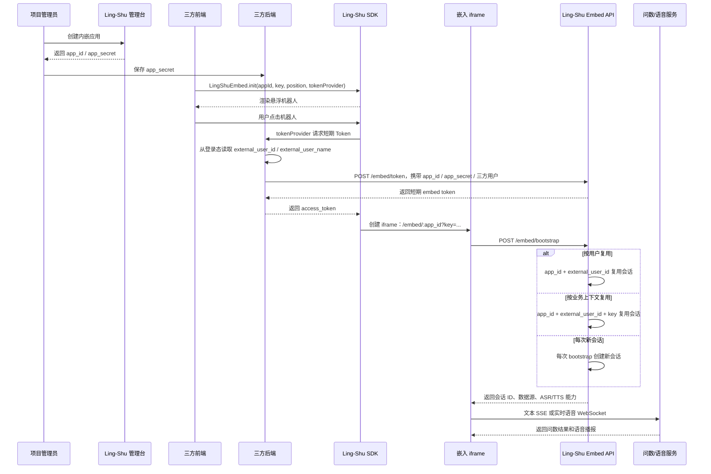

仓库提供了一个无依赖的临时三方系统 Demo：[examples/embed-third-party-demo](examples/embed-third-party-demo)。它用 Node.js 模拟第三方后端签发内嵌 Token，用普通 HTML 加载 Ling-Shu JS SDK，适合验证真实集成效果。创建内嵌应用后，先把 `http://localhost:8099` 加入允许嵌入来源，然后运行：

```bash
cd examples/embed-third-party-demo

LINGSHU_WEB_BASE_URL=http://localhost:5173 \
LINGSHU_API_BASE_URL=http://localhost:8080/api/v1 \
LINGSHU_EMBED_APP_ID=emb_xxx \
LINGSHU_EMBED_APP_SECRET=your_app_secret \
DEMO_EXTERNAL_USER_ID=third-party-user-001 \
DEMO_EXTERNAL_USER_NAME=三方系统测试用户 \
DEMO_SESSION_KEY=dashboard:demo \
node server.js
```

打开 `http://localhost:8099` 即可看到模拟三方系统页面和正式 SDK 悬浮机器人。`App Secret` 只保存在 Node 进程环境变量里，不会下发到浏览器。

`tokenProvider` 调用的是第三方系统自己的后端接口。第三方后端基于当前登录态拿到用户身份，再调用 Ling-Shu 签发短期内嵌 Token：

```js
await fetch("https://lingshu.example.com/api/v1/embed/token", {
  method: "POST",
  headers: { "Content-Type": "application/json" },
  body: JSON.stringify({
    app_id: "emb_xxx",
    app_secret: process.env.LINGSHU_EMBED_SECRET,
    external_user_id: currentUser.id,
    external_user_name: currentUser.name,
    ttl_seconds: 3600
  })
})
```

`external_user_id` 和 `external_user_name` 都来自第三方系统自己的用户体系，例如员工号、会员 ID、用户昵称或姓名。公开未登录页面也可以由第三方后端生成匿名访客 ID，并通过第三方 cookie/session 保持稳定。Ling-Shu 不要求第三方用户登录 Ling-Shu，也不会把后台管理 token 暴露给 SDK。

会话隔离由内嵌应用的会话策略决定：

- **按用户复用（`user`）**：同一个 `app_id + external_user_id` 始终进入同一个默认会话，SDK 传入的 `key` 会被忽略。适合“我的数据助手”“个人经营助手”这类长期个人上下文。
- **按业务上下文复用（`context`）**：同一个 `app_id + external_user_id + key` 复用一个会话。`key` 由第三方页面传入，例如 `dashboard:123`、`customer:456`、`order:789`。适合看板、客户详情、订单详情等业务页面，这是默认推荐策略。
- **每次新会话（`new`）**：每次 iframe bootstrap 都创建新会话，即使用户和 `key` 相同也不会复用。适合演示、临时分析、一次性问答或不希望保留上下文的场景。

如果项目配置了 ASR/TTS，`/embed/bootstrap` 会返回能力开关，嵌入页会自动显示语音输入并播放 TTS 音频；未配置时 SDK 会隐藏语音入口。SDK 创建的 iframe 会带上 `allow="microphone; autoplay"`，以支持浏览器麦克风和自动播放授权。

## 快速启动

### Docker Compose

```bash
docker compose up --build
```

默认会启动 API、MySQL 和 Redis。MySQL 首次启动会执行：

```text
scripts/mysql/001_init_schema.sql
```

该初始化脚本已包含第三方内嵌所需的 `embed_apps` 和 `embed_sessions` 表。已有数据库升级时按编号执行增量脚本，本次内嵌能力需要执行 `scripts/mysql/007_embed_apps.sql`，它会同时补齐加密保存 `App Secret` 的字段。

Milvus 单独启动：

```bash
docker compose -f docker-compose-milvus.yml up -d
```

### 后端

```bash
cp configs/config.example.yaml configs/config.yaml
go run ./cmd/server -config configs/config.yaml
```

默认监听：

```text
http://localhost:8080
```

### 前端

```bash
cd frontend
pnpm install
pnpm dev
```

默认监听：

```text
http://localhost:5173
```

前端会通过 Vite 代理访问后端 API 和 WebSocket。

## 业务流程

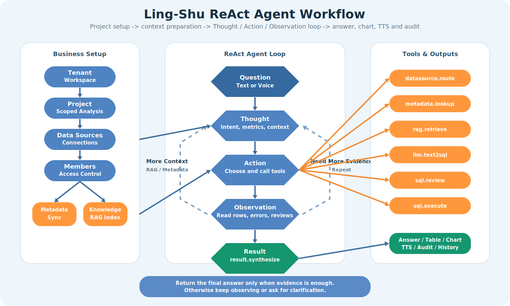

这条链路从项目配置和知识准备开始，进入 ReAct 循环：**Thought -> Action -> Observation -> Repeat / Result**。Agent 会基于元数据、RAG、SQL 审核、查询返回行或用户澄清持续观察，只有证据足够时才输出最终答案。

## 运行原理

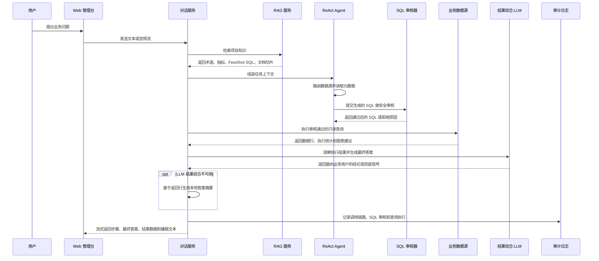

核心原则：

- **元数据优先**：Text2SQL Prompt 会注入已同步的库表、字段、注释、索引、主外键和项目绑定关系。
- **业务语言优先**：RAG 会注入术语和指标口径，让用户可以直接说“GMV”“活跃用户”“新增客户”等业务词。
- **先审核再执行**：SQL 执行前必须经过安全审核，写入语句、DDL、多语句和高风险模式会被拦截。
- **迭代式 ReAct 循环**：Agent 会重复 Thought -> Action -> Observation，直到拥有足够可信的数据或需要用户澄清。
- **边界保持轻量**：普通 CRUD 走清晰的 `handler -> service -> repository -> model` 链路，高变化的 AI、RAG、Provider、数据源插件独立封装。
- **工具后继续观察**：SQL 执行完成后会把返回行交给结果综合链路，让最终答案基于工具观察结果生成；本地摘要只作为兜底。
- **语音只是输入输出方式**：ASR 会转成同一条对话请求，TTS 播放精简后的答案摘要，不播放完整推理过程或用户原问题。

## API 概览

业务接口统一位于：

```text
/api/v1
```

主要模块：

- `/auth/*` 用户注册和登录
- `/tenants/*` 租户和租户成员，支持成员启用、停用和删除
- `/projects/*` 项目、项目成员授权、Provider 配置、知识库、RAG
- `/datasources/*` 数据源测试、元数据同步、元数据预览
- `/chat/*` 会话、消息、消息流式接口、实时语音接口
- `/embed/*` 第三方内嵌 Token、Bootstrap、嵌入会话消息和实时语音接口
- `/query/*` SQL 审核、执行和历史
- `/providers/*` LLM / ASR / TTS Provider 工具接口
- `/audit/*` 审计日志和查询执行记录

需要认证的接口请带上：

```text
Authorization: Bearer <access_token>
```

## 开发

运行后端测试：

```bash
go test ./...
```

构建前端：

```bash
pnpm --dir frontend build
```

## 安全提醒

- 不要提交 `configs/config.yaml`、`config.yaml`、`.env` 或任何 Provider 密钥。
- 公开仓库只保留 `configs/config.example.yaml`。
- 生产环境建议给业务数据源使用只读账号。

## 开源协议

Ling-Shu 基于 [MIT License](LICENSE) 开源。
