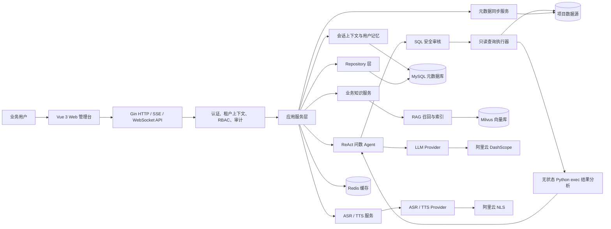
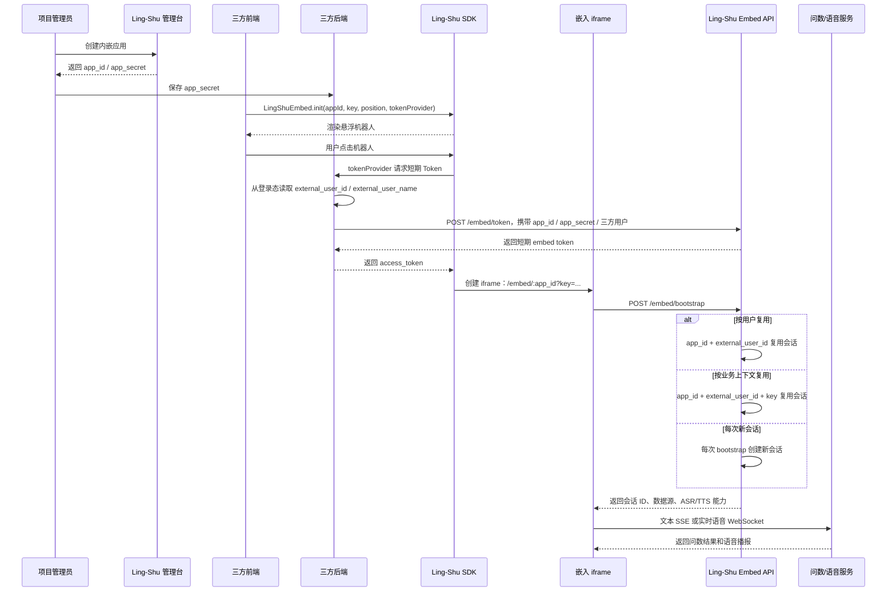
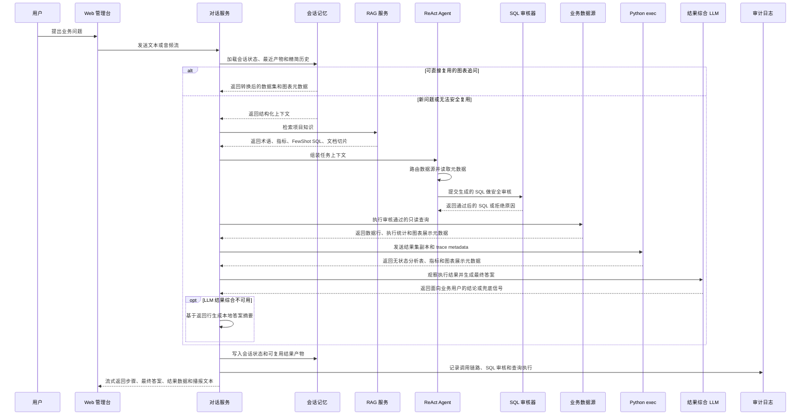

# Ling-Shu（灵数）

[English](README.md)

Ling-Shu 是一个企业级 ChatBI / Text2SQL / VoiceBI 平台。用户可以用自然语言向企业数据库提问，系统通过 ReAct Agent 循环完成任务规划、数据源路由、SQL 生成、安全审核、查询执行、结果汇总和图表展示，并支持流式 ASR/TTS 语音交互。

后端围绕自然语言问数主链路做模块化组织：项目管理、数据源插件、元数据同步、RAG、ReAct Agent 执行、权限、审计、ASR 和 TTS 等能力都放在 `internal/` 下，便于按功能持续演进。

## Web 管理台

### 对话问数与 ReAct 结果观察


### 数据源与元数据


### 项目、成员、知识与审计


## 核心能力

- 自然语言问数，采用 ReAct Agent 方式循环完成用户任务。
- 多租户模型：Tenant -> Project -> DataSource。
- 项目级多数据源问答，支持跨数据源查询结果汇总与综合回答。
- SQL 安全审核：仅允许 SELECT，禁止写入和 DDL，支持结果行数限制、超时控制和审计记录。
- 元数据同步：Schema、Table、Column、Index、PrimaryKey、ForeignKey。
- 业务知识 RAG：业务术语、指标口径、FewShot SQL。
- 结构化会话记忆：保存当前焦点和查询结果产物，支持基于上一轮结果继续制作柱状图、折线图、饼图或表格，无需重复调用 LLM 和 SQL。
- 跨会话用户长期记忆：保存稳定的个人偏好、职责和约定，支持显式记住/忘记、候选确认、项目级覆盖、语义召回和个人管理界面。
- Agent 时间上下文：浏览器 IANA 时区优先，每次请求固定一个时间快照并注入规划、路由、Text2SQL、结果综合和记忆提取 Prompt。
- LLM / ASR / TTS Provider 化，目前重点适配阿里云。
- VoiceBI：流式 ASR 输入和流式 TTS 播放。
- 第三方系统内嵌：项目可创建 Embed App，第三方页面通过轻量 JS SDK 出现悬浮机器人，并在弹窗 iframe 中完成文本问数和项目级 ASR/TTS 语音交互。
- RBAC 权限角色：SuperAdmin、TenantAdmin、ProjectAdmin、Analyst、Viewer；组织/项目成员支持启用、停用和移除，主管理员受保护。
- Vue 3 + TypeScript + Naive UI 前端管理台。

## 技术栈

- 后端：Go、Gin、GORM、Zap
- 结果分析沙箱：Python、gRPC、pandas、numpy
- 前端：Vue 3、TypeScript、Vite、Naive UI
- 数据库：MySQL 8
- 缓存：Redis
- 向量数据库：Milvus
- AI Provider：阿里云 DashScope / NLS
- 部署：Docker、Docker Compose、Kubernetes

## 系统架构


```mermaid
flowchart LR
  User["业务用户"] --> Web["Vue 3 Web 管理台"]
  Web --> API["Gin HTTP / SSE / WebSocket API"]
  API --> Gate["认证、租户上下文、RBAC、审计"]
  Gate --> Service["应用服务层"]

  Service --> Agent["ReAct 问数 Agent"]
  Service --> Memory["会话上下文与用户记忆"]
  Service --> Knowledge["业务知识服务"]
  Service --> Metadata["元数据同步服务"]
  Service --> Voice["ASR / TTS 服务"]
  Service --> Repo["Repository 层"]

  Agent --> Review["SQL 安全审核"]
  Review --> Executor["只读查询执行器"]
  Executor --> Sources[("项目数据源")]
  Executor --> PyExec["无状态 Python exec 结果分析"]
  PyExec --> Agent

  Knowledge --> RAG["RAG 召回与索引"]
  RAG --> Milvus[("Milvus 向量库")]

  Metadata --> Sources
  Memory --> MySQL[("MySQL 元数据库")]
  Repo --> MySQL
  Service --> Redis[("Redis 缓存")]
  Agent --> LLM["LLM Provider"]
  Voice --> Speech["ASR / TTS Provider"]
  LLM --> Aliyun["阿里云 DashScope"]
  Speech --> AliyunNLS["阿里云 NLS"]
```

运行时可以分成五个边界：

- **控制面**：租户、用户、项目、数据源绑定、Provider 配置、权限和审计记录保存在 MySQL。
- **知识面**：业务术语、指标口径、FewShot SQL 和文档切片向量化后进入 Milvus，用于项目级 RAG 召回。
- **记忆面**：`internal/memory` 同时管理会话内的结果产物和跨会话的个人长期记忆。MySQL 保存记忆正文、证据、状态、事件、会话摘要与后台任务；Milvus 的独立集合用于个人记忆语义召回。
- **执行面**：Agent 只能对当前项目绑定的数据源执行通过审核的只读 SQL。
- **分析面**：Python exec 是无状态 gRPC 服务，只接收 Go 传入的已审核查询结果副本，用 pandas/numpy 做结构化摘要、指标和图表展示元数据，不连接业务库、不保存会话状态。

## 会话上下文与用户记忆

Ling-Shu 不把“记忆”等同于把全部聊天历史重新发送给模型。每轮成功查询都会生成可追溯的结果产物，记录字段、行快照、图表配置、维度、指标单位、数据完整性、数据源和查询执行 ID。会话状态只保存当前有效产物和焦点产物，后续追问先由 `memory` 包解析，再决定复用结果还是进入 ReAct Agent。

- “换成柱状图”“做个饼图”“用表格展示”等请求会优先复用最近的合适产物；命中后不会调用 RAG、LLM 或 SQL。
- 明细结果没有数值指标时，只有确认结果完整才允许在本地按维度计数；被行数上限截断的数据不会冒充全量统计。
- 指标带有单位语义，不同单位的标量不会被拼成同一张分布图；候选目标同等相关时会要求用户选择。
- 读取和写入始终校验 `tenant_id`、`project_id`、`session_id` 和 `user_id`，避免跨租户、跨项目或跨用户召回。
- 旧会话无需迁移消息内容；系统可以从已有 `agent_result` 消息提炼临时产物，并在后续成功轮次写入新的结构化状态。

### 跨会话用户长期记忆

用户可以在对话中说“请记住以后默认用柱状图”“你记得我什么”“忘记我的图表偏好”，也可以从左侧导航打开“我的记忆”弹窗进行添加、编辑、确认、拒绝、删除和清空。

- 显式保存立即生效；模型从普通对话中识别出的稳定个人信息只进入 `candidate`，必须由用户确认后才会进入 Agent Prompt。
- 默认作用于当前项目；用户明确说“所有项目”或在管理界面选择“所有项目”时，才写入租户级个人记忆。同一个稳定键存在两级值时，当前项目值覆盖跨项目值。
- 召回先按 `tenant_id + project_id + user_id` 查询 MySQL，再合并关键词分数和独立 Milvus 集合中的语义分数，并在注入 Prompt 前执行状态、过期、敏感级别、去重和字符预算过滤。
- 长期记忆只接收稳定的个人信息、偏好、职责、约定和纠正；受限敏感内容会被策略层拒绝。召回内容在 Prompt 中被标记为用户背景数据，不能覆盖当前问题、数据权限、安全规则或指标口径。
- 每轮普通对话会更新有过期时间的会话摘要，并通过 `memory_jobs` 异步执行候选提取和向量索引。任务最多重试三次，Milvus 不可用时关键词召回仍可继续工作。

### Agent 时间上下文

文本、实时语音和内嵌问数都会发送浏览器的 IANA 时区，例如 `Asia/Shanghai`。服务端在请求开始时生成一次时间快照，统一提供用户本地时间、时区、UTC 偏移、UTC 时间和星期，供所有 Agent LLM Prompt 解释“现在、今天、昨天、本周、最近”等相对时间。浏览器时区缺失或非法时，先尝试用户保存的时区偏好，再使用 `app.timezone`。

## 数据源支持

当前已接入插件注册机制：

- MySQL
- PostgreSQL
- KingbaseES
- SQL Server
- Oracle
- ClickHouse
- Doris
- 达梦 DM8

## 项目结构

```text
cmd/server/        服务启动入口
configs/           配置示例
docs/              架构与设计文档
exec/              无状态 Python 结果集分析 gRPC 服务
frontend/          Vue 3 前端
internal/          业务模块
  aliyun/          阿里云 SDK 集成（如 NLS）
  asr/             ASR Provider
  audit/           审计类型定义
  auth/            密码哈希与 Token 工具
  bootstrap/       服务组装与依赖装配
  cache/           Redis 客户端与分布式锁
  config/          配置加载
  database/        MySQL/GORM 连接
  datasource/      数据源插件与元数据同步
  handler/         HTTP 和实时接口
  llm/             LLM Provider
  memory/          会话产物、用户长期记忆、召回策略与后台任务
  middleware/      Gin 中间件
  model/           GORM Model
  query/           ReAct Agent 与 SQL 执行
  rag/             RAG 与 Milvus
  repository/      数据访问层
  router/          路由
  service/         业务服务层
  tts/             TTS Provider
pkg/               公共包
  log/             日志工具
  response/        统一响应封装
  secret/          密钥加解密
prompts/           Prompt 模板
shared/proto/      跨语言 gRPC 协议
scripts/mysql/     MySQL 初始化脚本
deploy/            部署配置
  docker/          Docker Compose 全栈部署
  k8s/             Kubernetes 配置
```

## 配置

不要提交本地密钥。先从示例配置复制一份本地配置：

```bash
cp configs/config.example.yaml configs/config.yaml
```

然后编辑 `configs/config.yaml`。该文件已加入 `.gitignore`，用于本地私有配置。

常用环境变量：

```bash
export LING_SHU_ALIYUN_API_KEY="your-dashscope-api-key"
export LING_SHU_APP_TIMEZONE="Asia/Shanghai"
export LING_SHU_ASR_ENABLED=true
export LING_SHU_TTS_ENABLED=true
export ALIYUN_AK_ID="your-access-key-id"
export ALIYUN_AK_SECRET="your-access-key-secret"
export LING_SHU_ALIYUN_NLS_APP_KEY="your-nls-app-key"
```

ASR 和 TTS 是可选能力。TTS 未启用时，语音问数仍会返回转写文本和 ChatBI 结果，只是不生成播报音频。

Python exec 是可选增强能力。默认配置关闭；启用后，Go 会把 SQL 执行器返回的结果集副本发送到 `exec` gRPC 服务做无状态分析，并通过 `request_id`、租户、项目、会话和用户字段贯穿 API 日志、Python 日志和审计记录。

```bash
export LING_SHU_EXEC_ENABLED=true
export LING_SHU_EXEC_GRPC_ADDR=127.0.0.1:50051
export LING_SHU_EXEC_FAIL_OPEN=true
```

`LING_SHU_EXEC_FAIL_OPEN=true` 表示 Python exec 不可用时保留原始 SQL 结果继续回答；设为 `false` 后 readiness 会把 exec 当作硬依赖。

exec 启用后会在内部自动选择合适的 Python 分析策略。结果综合 prompt 会按运行状态切换：`disabled` 时只观察 SQL 原始结果，`available` 时可使用 Python 增强后的表格、指标和图表展示元数据，`unavailable` 时按无增强结果回答并避免把内部故障暴露给最终用户。更多本地调试、配置和日志字段见 [exec/README-zh.md](/Users/fanxiangqing/Developer/golang/ling-shu/exec/README-zh.md)。

## 第三方系统内嵌

项目管理页的项目卡片提供“内嵌”入口。创建内嵌应用后，系统会返回：

- `app_id`：公开应用 ID，可放在第三方前端。
- `app_secret`：应用密钥，会加密保存在 Ling-Shu 服务端，可在项目管理权限下随时查看；第三方系统仍应只保存在后端，不能下发到浏览器。
- SDK 集成代码：第三方页面加载 `sdk/ling-shu-embed.js` 后，会自动出现带内置图标的悬浮机器人，点击后打开适合问数结果展示的对话弹窗。

内嵌应用列表支持复制 `app_id`、查看/复制 `App Secret`、启用、停用和删除。停用后不能再签发新的内嵌 Token，已有嵌入会话也会在下一次请求时失效；删除会软删除应用并关闭相关活跃内嵌会话，原 `app_id` 不再可用。

列表里的“集成测试”会自动签发测试 Token，并在控制台内以接近全屏的方式模拟第三方系统页面加载正式 JS SDK；可以提前验证小机器人入口、弹窗 iframe、会话策略、允许来源以及项目级 ASR/TTS 是否可用。

前端集成示例：

```html
<script src="https://lingshu.example.com/sdk/ling-shu-embed.js"></script>
<script>
  LingShuEmbed.init({
    appId: "emb_xxx",
    key: "dashboard:123",
    position: "bottom-right",
    launcher: { title: "智能问数" },
    tokenProvider: () => fetch("/api/lingshu/embed-token").then((res) => res.json())
  })
</script>
```

SDK 默认以右下角悬浮按钮启动，桌面端弹窗会预留更多空间展示表格、SQL 和语音交互结果；移动端会自动贴近全屏展示。`position` 可设置为 `bottom-right`、`bottom-left`、`top-right` 或 `top-left`，`launcher.title` 可覆盖悬浮按钮文案。


```mermaid
sequenceDiagram
  participant Admin as 项目管理员
  participant Console as Ling-Shu 管理台
  participant ThirdFE as 三方前端
  participant ThirdBE as 三方后端
  participant SDK as Ling-Shu SDK
  participant Embed as 嵌入 iframe
  participant API as Ling-Shu Embed API
  participant Chat as 问数/语音服务

  Admin->>Console: 创建内嵌应用
  Console-->>Admin: 返回 app_id / app_secret
  Admin->>ThirdBE: 保存 app_secret
  ThirdFE->>SDK: LingShuEmbed.init(appId, key, position, tokenProvider)
  SDK-->>ThirdFE: 渲染悬浮机器人
  ThirdFE->>SDK: 用户点击机器人
  SDK->>ThirdBE: tokenProvider 请求短期 Token
  ThirdBE->>ThirdBE: 从登录态读取 external_user_id / external_user_name
  ThirdBE->>API: POST /embed/token，携带 app_id / app_secret / 三方用户
  API-->>ThirdBE: 返回短期 embed token
  ThirdBE-->>SDK: 返回 access_token
  SDK->>Embed: 创建 iframe：/embed/:app_id?key=...#token=...
  Embed->>API: POST /embed/bootstrap
  alt 按用户复用
    API->>API: app_id + external_user_id 复用会话
  else 按业务上下文复用
    API->>API: app_id + external_user_id + key 复用会话
  else 每次新会话
    API->>API: 每次 bootstrap 创建新会话
  end
  API-->>Embed: 返回会话 ID、数据源、ASR/TTS 能力
  Embed->>Chat: 文本 SSE 或实时语音 WebSocket
  Chat-->>Embed: 返回问数结果和语音播报
```

仓库提供了一个无依赖的临时三方系统 Demo：[examples/embed-third-party-demo](examples/embed-third-party-demo)。它用 Node.js 模拟第三方后端签发内嵌 Token，用普通 HTML 加载 Ling-Shu JS SDK，适合验证真实集成效果。创建内嵌应用后，先把 `http://localhost:8099` 加入允许嵌入来源，然后运行：

```bash
cd examples/embed-third-party-demo

LINGSHU_WEB_BASE_URL=http://localhost:5173 \
LINGSHU_API_BASE_URL=http://localhost:8080/api/v1 \
LINGSHU_EMBED_APP_ID=emb_xxx \
LINGSHU_EMBED_APP_SECRET=your_app_secret \
DEMO_EXTERNAL_USER_ID=third-party-user-001 \
DEMO_EXTERNAL_USER_NAME=三方系统测试用户 \
DEMO_SESSION_KEY=dashboard:demo \
node server.js
```

打开 `http://localhost:8099` 即可看到模拟三方系统页面和正式 SDK 悬浮机器人。`App Secret` 只保存在 Node 进程环境变量里，不会下发到浏览器。

`tokenProvider` 调用的是第三方系统自己的后端接口。第三方后端基于当前登录态拿到用户身份，再调用 Ling-Shu 签发短期内嵌 Token：

```js
await fetch("https://lingshu.example.com/api/v1/embed/token", {
  method: "POST",
  headers: { "Content-Type": "application/json" },
  body: JSON.stringify({
    app_id: "emb_xxx",
    app_secret: process.env.LINGSHU_EMBED_SECRET,
    external_user_id: currentUser.id,
    external_user_name: currentUser.name,
    ttl_seconds: 3600
  })
})
```

`external_user_id` 和 `external_user_name` 都来自第三方系统自己的用户体系，例如员工号、会员 ID、用户昵称或姓名。公开未登录页面也可以由第三方后端生成匿名访客 ID，并通过第三方 cookie/session 保持稳定。Ling-Shu 不要求第三方用户登录 Ling-Shu，也不会把后台管理 token 暴露给 SDK。

### 服务端集成模式

有些第三方系统不希望使用 Ling-Shu 的 iframe，而是希望自己的后端直接调用问数能力、自己的前端完全自定义页面。生产集成时仍然复用同一个 Embed App：`app_id` 可以视为公开应用标识，`app_secret` 必须只保存在第三方后端，不能下发到浏览器。

服务端模式的调用方不需要传 `tenant_id`、`project_id`、`user_id` 或数据源 ID。Ling-Shu 会根据 `app_id` 找到内嵌应用所属项目，并在该项目已绑定且启用的数据源范围内自动完成路由、SQL 生成、审核和执行。如果希望把不同业务系统隔离到不同数据源范围，推荐在 Ling-Shu 中创建不同项目或不同 Embed App，而不是让第三方请求直接选择内部数据源。

#### 一步式问数

第三方后端拿到当前登录用户后，直接调用：

```http
POST https://lingshu.example.com/api/v1/embed/server/chat
Content-Type: application/json
X-Ling-Shu-App-Id: emb_xxx
X-Ling-Shu-App-Secret: lsk_xxx
X-Ling-Shu-External-User-Id: third-party-user-001
X-Ling-Shu-External-User-Name: 三方系统用户
```

```json
{
  "key": "dashboard:123",
  "content": "统计本月销售额和订单数",
  "max_rows": 200,
  "auto_execute": true
}
```

字段含义：

- `key`：业务上下文标识，例如 `dashboard:123`、`customer:456`、`order:789`。当 Embed App 的会话策略是 `context` 时，同一个 `external_user_id + key` 会复用同一个问数会话。
- `content`：用户的自然语言问题。
- `max_rows`：最多返回多少行，省略时使用服务端 SQL 审核器默认上限。
- `auto_execute`：是否自动执行审核通过的 SQL；服务端模式默认是 `true`，需要只生成 SQL 时可传 `false`。

也可以把 `app_id`、`app_secret`、`external_user_id`、`external_user_name` 放在 JSON body 中，便于服务端脚本或低代码系统调试；生产环境更推荐使用 Header，避免业务参数和密钥混在一起。

一个完整的 Node.js 后端示例：

```js
async function askLingShu(currentUser, question, contextKey) {
  const resp = await fetch("https://lingshu.example.com/api/v1/embed/server/chat", {
    method: "POST",
    headers: {
      "Content-Type": "application/json",
      "X-Ling-Shu-App-Id": process.env.LINGSHU_EMBED_APP_ID,
      "X-Ling-Shu-App-Secret": process.env.LINGSHU_EMBED_APP_SECRET,
      "X-Ling-Shu-External-User-Id": currentUser.id,
      "X-Ling-Shu-External-User-Name": currentUser.name
    },
    body: JSON.stringify({
      key: contextKey,
      content: question,
      max_rows: 200
    })
  })
  const body = await resp.json()
  if (!resp.ok || body.code !== 0) throw new Error(body.message || "Ling-Shu 问数失败")
  return body.data
}
```

仓库也提供了一个只依赖 Go 标准库的服务端 SDK 风格示例：[examples/embed-server-go-sdk](examples/embed-server-go-sdk)。它包含普通问数和 SSE 流式问数两种调用方式，适合第三方后端直接改造成自己的 client。

响应使用统一 envelope，`data` 中包含本次会话和问数结果。常用字段如下：

```json
{
  "code": 0,
  "message": "ok",
  "data": {
    "session": {
      "app_id": "emb_xxx",
      "session_id": 123,
      "session_key": "dashboard:123",
      "external_user_id": "third-party-user-001",
      "external_user_name": "三方系统用户"
    },
    "result": {
      "agent": {
        "answer": "本月销售额为 128000，订单数为 356。",
        "sql": "SELECT ...",
        "need_clarification": false,
        "review": { "passed": true, "risk_level": "low" }
      },
      "execution": {
        "columns": ["month", "sales_amount", "order_count"],
        "rows": [{ "month": "2026-08", "sales_amount": 128000, "order_count": 356 }],
        "chart": { "type": "bar" },
        "answer": "本月销售额为 128000，订单数为 356。"
      }
    }
  }
}
```

第三方页面通常读取 `data.result.execution.answer` 作为回答文本，读取 `columns` 和 `rows` 渲染表格，读取 `chart` 决定是否画柱状图、折线图等。如果 `execution` 为空但 `agent.need_clarification=true`，表示模型需要用户补充条件，此时展示 `agent.answer` 或 `agent.explanation` 即可。

#### 流式问数

如果第三方前端需要展示推理进度，第三方后端可以调用 SSE 接口并把事件转发给自己的前端：

```http
POST /api/v1/embed/server/chat/stream
Accept: text/event-stream
```

事件顺序：

```text
event: session       # 返回 session_id / session_key
event: thought       # Agent 正在理解问题
event: action        # Agent 选择工具或准备 SQL
event: observation   # RAG 命中、SQL 审核、SQL 执行结果等观察
event: result        # 最终结果，结构和 /embed/server/chat 的 data 基本一致
```

#### 显式管理会话

一步式接口会自动创建或复用会话。第三方后端如果想把 `session_id` 存到自己的数据库里，也可以先创建会话，再按 `session_id` 继续追问：

```text
POST /api/v1/embed/server/sessions
GET  /api/v1/embed/server/sessions/:session_id/messages
POST /api/v1/embed/server/sessions/:session_id/messages
POST /api/v1/embed/server/sessions/:session_id/messages/stream
```

访问已有 `session_id` 时仍需要携带同一个 `app_id/app_secret/external_user_id`。如果外部用户不匹配，Ling-Shu 会拒绝访问，避免一个三方用户读取另一个三方用户的会话。

这些服务端接口不会校验浏览器来源，因为调用方是第三方后端；但仍会校验 `app_secret`、`external_user_id` 和会话归属。审计日志会标记为 `embed_server`，便于区分 SDK iframe 产生的 `embed` 请求。

会话隔离由内嵌应用的会话策略决定：

- **按用户复用（`user`）**：同一个 `app_id + external_user_id` 始终进入同一个默认会话，SDK 传入的 `key` 会被忽略。适合“我的数据助手”“个人经营助手”这类长期个人上下文。
- **按业务上下文复用（`context`）**：同一个 `app_id + external_user_id + key` 复用一个会话。`key` 由第三方页面传入，例如 `dashboard:123`、`customer:456`、`order:789`。适合看板、客户详情、订单详情等业务页面，这是默认推荐策略。
- **每次新会话（`new`）**：每次 iframe bootstrap 都创建新会话，即使用户和 `key` 相同也不会复用。适合演示、临时分析、一次性问答或不希望保留上下文的场景。

如果项目配置了 ASR/TTS，`/embed/bootstrap` 会返回能力开关，嵌入页会自动显示语音输入并播放 TTS 音频；未配置时 SDK 会隐藏语音入口。SDK 创建的 iframe 会带上 `allow="microphone; autoplay"`，以支持浏览器麦克风和自动播放授权。

## 快速启动

### Docker Compose

完整本地栈位于 [deploy/docker](/Users/fanxiangqing/Developer/golang/ling-shu/deploy/docker)：

```bash
cd deploy/docker
cp .env.example .env
docker compose --env-file .env up -d --build
```

默认会启动 API、Web、无状态 Python exec、MySQL、Redis 和 Milvus。MySQL 首次启动会执行：

```text
scripts/mysql/001_init_schema.sql
```

该初始化脚本已包含第三方内嵌、会话记忆和用户长期记忆所需的表。已有数据库升级时请按编号执行增量脚本：第三方内嵌使用 `scripts/mysql/007_embed_apps.sql`，结构化会话上下文使用 `scripts/mysql/008_chat_context_memory.sql`，跨会话用户长期记忆、证据、事件、会话摘要和后台任务使用 `scripts/mysql/009_user_long_term_memory.sql`。

Milvus 启用后，用户长期记忆会使用独立集合 `<rag.milvus.collection>_user_memories`，其向量维度与知识库集合保持一致。

如果只想单独启动 Milvus：

```bash
docker compose -f docker-compose-milvus.yml up -d
```

### 后端

```bash
cp configs/config.example.yaml configs/config.yaml
go run ./cmd/server -config configs/config.yaml
```

默认监听：

```text
http://localhost:8080
```

### Python Exec

本地调试 Python exec 使用虚拟环境：

```bash
cd exec
python3 -m venv .venv
.venv/bin/python -m pip install -r requirements.txt
EXEC_GRPC_LISTEN=127.0.0.1:50051 .venv/bin/python server.py
```

然后在另一个终端启动 Go 后端，并设置：

```bash
export LING_SHU_EXEC_ENABLED=true
export LING_SHU_EXEC_GRPC_ADDR=127.0.0.1:50051
```

exec 服务不持有会话、不落盘业务数据、不直接访问数据源；每次请求都从输入结果集开始，在子进程中完成分析，结束后清理临时目录。

更多配置和追踪日志字段见 [exec/README-zh.md](/Users/fanxiangqing/Developer/golang/ling-shu/exec/README-zh.md)。

### 前端

```bash
cd frontend
pnpm install
pnpm dev
```

默认监听：

```text
http://localhost:5173
```

前端会通过 Vite 代理访问后端 API 和 WebSocket。

## 业务流程


这条链路从项目配置和知识准备开始，进入 ReAct 循环：**Thought -> Action -> Observation -> Repeat / Result**。Agent 会基于元数据、RAG、SQL 审核、查询返回行或用户澄清持续观察，只有证据足够时才输出最终答案。

## 运行原理


```mermaid
sequenceDiagram
  participant User as 用户
  participant Web as Web 管理台
  participant Chat as 对话服务
  participant Memory as 会话记忆
  participant RAG as RAG 服务
  participant Agent as ReAct Agent
  participant SQL as SQL 审核器
  participant DB as 业务数据源
  participant PyExec as Python exec
  participant LLM as 结果综合 LLM
  participant Audit as 审计日志

  User->>Web: 提出业务问题
  Web->>Chat: 发送文本或音频流
  Chat->>Memory: 加载会话状态、最近产物和精简历史
  alt 可直接复用的图表追问
    Memory-->>Chat: 返回转换后的数据集和图表元数据
  else 新问题或无法安全复用
    Memory-->>Chat: 返回结构化上下文
    Chat->>RAG: 检索项目知识
    RAG-->>Chat: 返回术语、指标、FewShot SQL、文档切片
    Chat->>Agent: 组装任务上下文
    Agent->>Agent: 路由数据源并读取元数据
    Agent->>SQL: 提交生成的 SQL 做安全审核
    SQL-->>Agent: 返回通过后的 SQL 或拒绝原因
    Chat->>DB: 执行审核通过的只读查询
    DB-->>Chat: 返回数据行、执行统计和图表展示元数据
    Chat->>PyExec: 发送结果集副本和 trace metadata
    PyExec-->>Chat: 返回无状态分析表、指标和图表展示元数据
    Chat->>LLM: 观察执行结果并生成最终答案
    LLM-->>Chat: 返回面向业务用户的结论或兜底信号
    opt LLM 结果综合不可用
      Chat->>Chat: 基于返回行生成本地答案摘要
    end
  end
  Chat->>Memory: 写入会话状态和可复用结果产物
  Chat->>Audit: 记录调用链路、SQL 审核和查询执行
  Chat-->>Web: 流式返回步骤、最终答案、结果数据和播报文本
```

核心原则：

- **元数据优先**：Text2SQL Prompt 会注入已同步的库表、字段、注释、索引、主外键和项目绑定关系。
- **业务语言优先**：RAG 会注入术语和指标口径，让用户可以直接说“GMV”“活跃用户”“新增客户”等业务词。
- **先审核再执行**：SQL 执行前必须经过安全审核，写入语句、DDL、多语句和高风险模式会被拦截。
- **结果先复用**：图表类追问优先复用当前会话中完整且单位兼容的结果产物，无法安全复用时才回到 Agent 查询链路。
- **Python 沙箱保持无状态**：Go 负责权限、SQL 审核、审计和会话状态；Python 只分析本次请求传入的结果集副本，日志贯穿 `request_id`、租户、项目、会话和用户字段。
- **迭代式 ReAct 循环**：Agent 会重复 Thought -> Action -> Observation，直到拥有足够可信的数据或需要用户澄清。
- **边界保持轻量**：普通 CRUD 走清晰的 `handler -> service -> repository -> model` 链路，高变化的 AI、RAG、Provider、数据源插件独立封装。
- **工具后继续观察**：SQL 执行完成后会把返回行交给结果综合链路，让最终答案基于工具观察结果生成；本地摘要只作为兜底。
- **语音只是输入输出方式**：ASR 会转成同一条对话请求，TTS 播放精简后的答案摘要，不播放完整推理过程或用户原问题。

## API 概览

业务接口统一位于：

```text
/api/v1
```

主要模块：

- `/auth/*` 用户注册和登录
- `/tenants/*` 租户和租户成员，支持成员启用、停用和删除
- `/projects/*` 项目、项目成员授权、Provider 配置、知识库、RAG
- `/projects/:project_id/memories/me` 当前用户的长期记忆列表、创建、编辑、确认、拒绝、删除和清空
- `/projects/:project_id/memory-episodes/me` 当前用户的项目会话摘要
- `/datasources/*` 数据源测试、元数据同步、元数据预览
- `/chat/*` 会话、消息、消息流式接口、实时语音接口
- `/embed/*` 第三方内嵌 Token、Bootstrap、嵌入会话消息、服务端问数集成和实时语音接口
- `/query/*` SQL 审核、执行和历史
- `/providers/*` LLM / ASR / TTS Provider 工具接口
- `/audit/*` 审计日志和查询执行记录

需要认证的接口请带上：

```text
Authorization: Bearer <access_token>
```

## 开发

运行后端测试：

```bash
go test ./...
```

构建前端：

```bash
pnpm --dir frontend build
```

## 安全提醒

- 不要提交 `configs/config.yaml`、`config.yaml`、`.env` 或任何 Provider 密钥。
- 公开仓库只保留 `configs/config.example.yaml`。
- 生产环境建议给业务数据源使用只读账号。

## 开源协议

Ling-Shu 基于 [MIT License](LICENSE) 开源。
