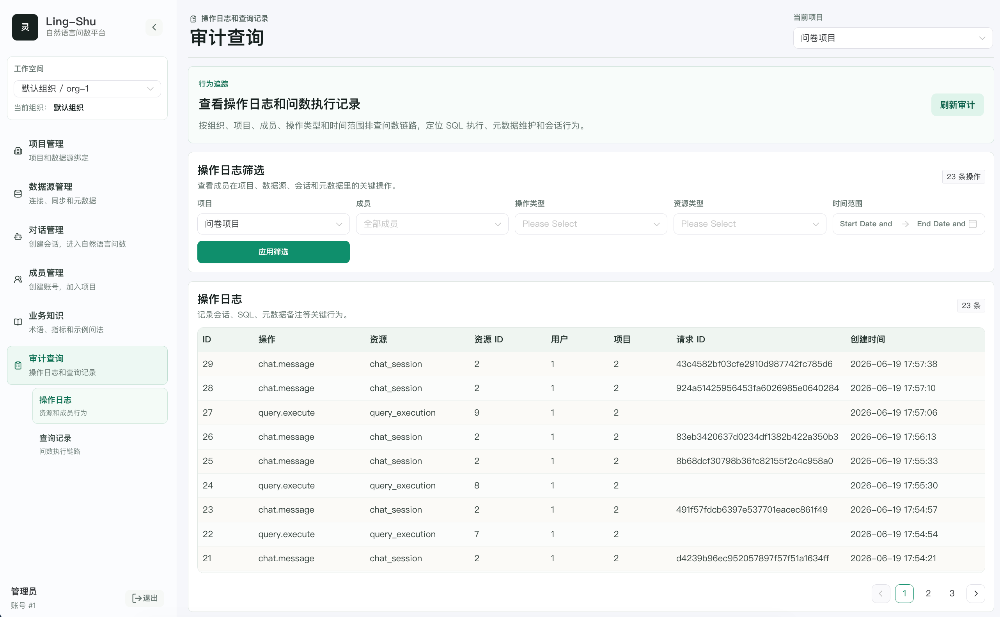
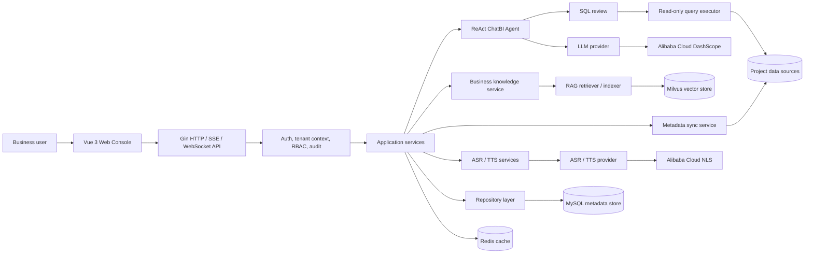
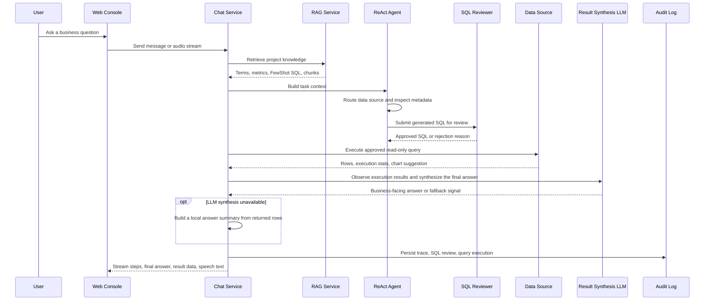

# Ling-Shu

[中文文档](README-zh.md)

Ling-Shu is an enterprise ChatBI / Text2SQL / VoiceBI platform. Users ask questions in natural language, and Ling-Shu plans the task, routes it to project data sources, generates safe SQL, executes approved queries, renders results, and can continue the interaction through streaming ASR/TTS.

The backend keeps the core analytics flow clear and modular: project management, data source connectors, metadata sync, RAG, ReAct Agent execution, permissions, audit logs, ASR, and TTS are organized as focused modules under `internal/`.

## Web Console

### ChatBI ReAct Answer


### Data Sources And Metadata


### Project, Members, Knowledge, And Audit




## Highlights

- Natural-language analytics with a ReAct-style agent loop.
- Project-scoped multi-tenant model: Tenant -> Project -> DataSource.
- Multi-data-source question answering and result synthesis.
- SQL safety review: SELECT-only, forbidden write/DDL statements, row limits, timeout control, and audit logs.
- Metadata sync for schemas, tables, columns, indexes, primary keys, and foreign keys.
- RAG over business terms, metric definitions, and FewShot SQL examples.
- Provider-based LLM, ASR, and TTS integrations. The current implementation focuses on Alibaba Cloud.
- Realtime VoiceBI: streaming ASR input and streaming TTS playback.
- RBAC roles for SuperAdmin, TenantAdmin, ProjectAdmin, Analyst, and Viewer.
- Vue 3 + TypeScript + Naive UI frontend.

## Tech Stack

- Backend: Go, Gin, GORM, Zap
- Frontend: Vue 3, TypeScript, Vite, Naive UI
- Database: MySQL 8
- Cache: Redis
- Vector database: Milvus
- AI providers: Alibaba Cloud DashScope / NLS
- Deployment: Docker, Docker Compose, Kubernetes manifests

## Architecture



The runtime has three clear boundaries:

- **Control plane**: tenants, users, projects, data source bindings, provider configs, permissions, and audit logs live in MySQL.
- **Knowledge plane**: business terms, metric definitions, FewShot SQL, and document chunks are embedded and retrieved from Milvus.
- **Execution plane**: the agent only executes reviewed read-only SQL against project-bound data sources.

## Supported Data Sources

Implemented connector registry:

- MySQL
- PostgreSQL
- KingbaseES
- SQL Server
- Oracle
- ClickHouse
- Doris
- Dameng DM8

## Repository Layout

```text
cmd/server/        HTTP server entrypoint
configs/           Configuration examples
docs/              Architecture and design notes
frontend/          Vue 3 frontend
internal/          Application modules
  asr/             ASR providers
  audit/           Audit domain
  chat/            Chat module
  datasource/      Data source drivers and metadata sync
  handler/         HTTP and realtime handlers
  llm/             LLM providers
  middleware/      Gin middleware
  model/           GORM models
  permission/      RBAC permissions
  query/           ReAct agent and SQL execution
  rag/             RAG and Milvus integration
  repository/      Persistence layer
  router/          API routes
  service/         Business services
  tts/             TTS providers
pkg/               Shared packages
prompts/           Prompt templates
scripts/mysql/     MySQL schema scripts
deploy/            Kubernetes manifests
```

## Configuration

Do not commit local secrets. Create a local config from the example:

```bash
cp configs/config.example.yaml configs/config.yaml
```

Then edit `configs/config.yaml` locally. The file is ignored by Git.

The most common environment variables are:

```bash
export LING_SHU_ALIYUN_API_KEY="your-dashscope-api-key"
export LING_SHU_ASR_ENABLED=true
export LING_SHU_TTS_ENABLED=true
export ALIYUN_AK_ID="your-access-key-id"
export ALIYUN_AK_SECRET="your-access-key-secret"
export LING_SHU_ALIYUN_NLS_APP_KEY="your-nls-app-key"
```

ASR and TTS are optional. If TTS is disabled, voice questions can still return transcript and ChatBI results, but no speech audio will be generated.

## Quick Start

### Docker Compose

```bash
docker compose up --build
```

The compose stack starts the API server, MySQL, and Redis. MySQL initializes from:

```text
scripts/mysql/001_init_schema.sql
```

Milvus can be started separately:

```bash
docker compose -f docker-compose-milvus.yml up -d
```

### Backend

```bash
cp configs/config.example.yaml configs/config.yaml
go run ./cmd/server -config configs/config.yaml
```

The API server listens on `http://localhost:8080` by default.

### Frontend

```bash
cd frontend
pnpm install
pnpm dev
```

The frontend listens on `http://localhost:5173` by default and proxies API/WebSocket requests to the backend.

## Business Workflow


The workflow starts from project setup and knowledge preparation, then enters the ReAct loop: **Thought -> Action -> Observation -> Repeat / Result**. The agent only returns a final answer after it has enough evidence from metadata, RAG, SQL review, query rows, or clarification.

## How It Works



Core principles:

- **Metadata first**: Text2SQL prompts are grounded in synced schemas, table comments, column comments, keys, and project bindings.
- **Business language first**: RAG injects domain terms and metric definitions so users can ask with words like "GMV", "active users", or internal aliases.
- **Safety before execution**: SQL is parsed and reviewed before execution. Write statements, DDL, multi-statement payloads, and unsafe patterns are blocked.
- **Iterative ReAct loop**: the agent repeats Thought -> Action -> Observation until it has enough trustworthy data or needs user clarification.
- **Small surface area**: the backend keeps the ordinary CRUD path simple and isolates high-change AI, RAG, provider, and connector code behind focused modules.
- **Observation after tools**: after SQL execution, returned rows are fed back into result synthesis so the answer is based on tool observations, with local summaries as a fallback.
- **Voice is a transport, not a separate product path**: ASR turns speech into the same chat request, and TTS speaks a concise answer summary instead of replaying the full trace.

## API Overview

All business APIs are under:

```text
/api/v1
```

Common modules:

- `/auth/*` user registration and login
- `/tenants/*` tenant and tenant member management
- `/projects/*` projects, members, provider config, knowledge, RAG
- `/datasources/*` data source test, metadata sync, metadata preview
- `/chat/*` sessions, messages, streaming message API, realtime voice API
- `/query/*` SQL review, execution, and history
- `/providers/*` LLM / ASR / TTS provider utilities
- `/audit/*` audit logs and query execution records

Use:

```text
Authorization: Bearer <access_token>
```

for authenticated APIs.

## Development

Run all backend tests:

```bash
go test ./...
```

Build the frontend:

```bash
pnpm --dir frontend build
```

## Security Notes

- Never commit `configs/config.yaml`, `config.yaml`, `.env`, or provider credentials.
- Use `configs/config.example.yaml` as the public template.
- The current SQL executor is designed for read-only analytics queries. Keep data source accounts read-only in production.

## License

Ling-Shu is released under the [MIT License](LICENSE).
