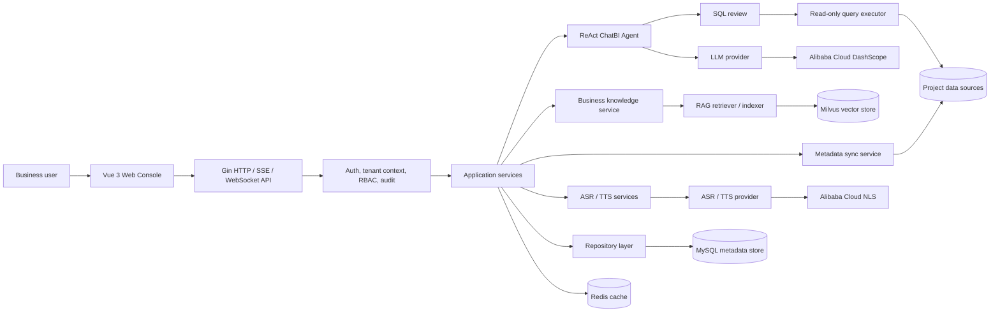
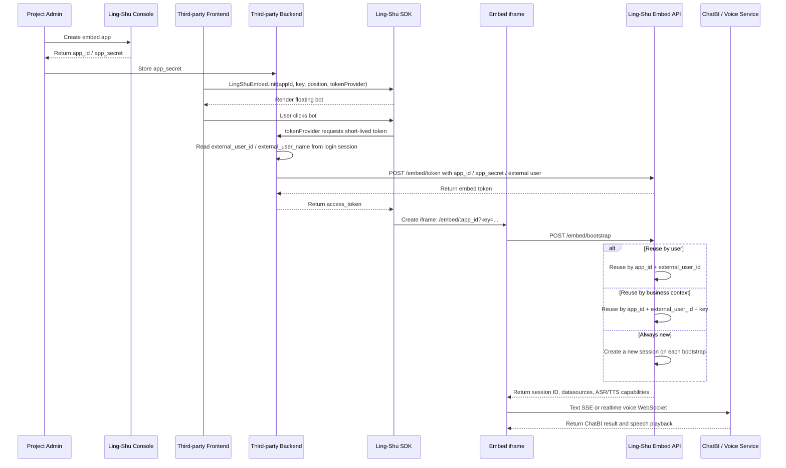
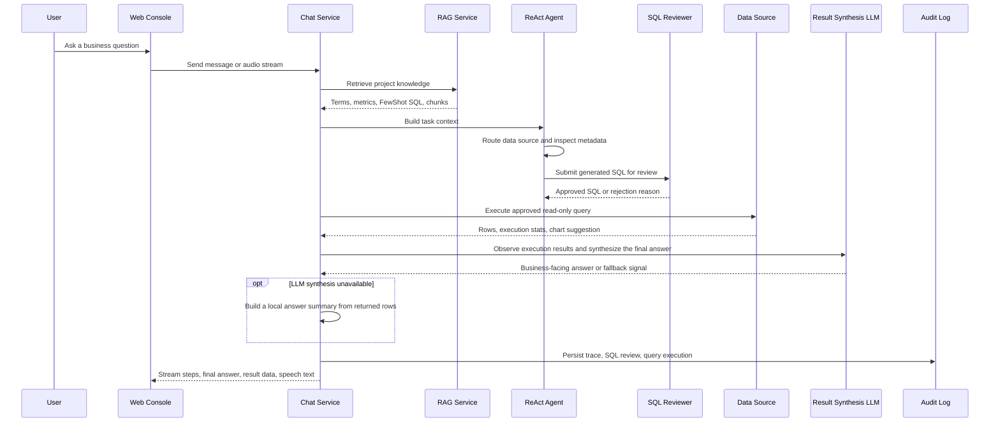

# Ling-Shu

[中文文档](README-zh.md)

Ling-Shu is an enterprise ChatBI / Text2SQL / VoiceBI platform. Users ask questions in natural language, and Ling-Shu plans the task, routes it to project data sources, generates safe SQL, executes approved queries, renders results, and can continue the interaction through streaming ASR/TTS.

The backend keeps the core analytics flow clear and modular: project management, data source connectors, metadata sync, RAG, ReAct Agent execution, permissions, audit logs, ASR, and TTS are organized as focused modules under `internal/`.

## Web Console

### ChatBI ReAct Answer


### Data Sources And Metadata


### Project, Members, Knowledge, And Audit


## Highlights

- Natural-language analytics with a ReAct-style agent loop.
- Project-scoped multi-tenant model: Tenant -> Project -> DataSource.
- Multi-data-source question answering and result synthesis.
- SQL safety review: SELECT-only, forbidden write/DDL statements, row limits, timeout control, and audit logs.
- Metadata sync for schemas, tables, columns, indexes, primary keys, and foreign keys.
- RAG over business terms, metric definitions, and FewShot SQL examples.
- Provider-based LLM, ASR, and TTS integrations. The current implementation focuses on Alibaba Cloud.
- Realtime VoiceBI: streaming ASR input and streaming TTS playback.
- Third-party embedding: each project can create Embed Apps; third-party pages load a small JS SDK that renders a floating bot and opens a modal iframe for ChatBI and project-scoped ASR/TTS.
- RBAC roles for SuperAdmin, TenantAdmin, ProjectAdmin, Analyst, and Viewer; tenant/project members can be enabled, disabled, and removed, while the primary tenant admin is protected.
- Vue 3 + TypeScript + Naive UI frontend.

## Tech Stack

- Backend: Go, Gin, GORM, Zap
- Frontend: Vue 3, TypeScript, Vite, Naive UI
- Database: MySQL 8
- Cache: Redis
- Vector database: Milvus
- AI providers: Alibaba Cloud DashScope / NLS
- Deployment: Docker, Docker Compose, Kubernetes manifests

## Architecture



The runtime has three clear boundaries:

- **Control plane**: tenants, users, projects, data source bindings, provider configs, permissions, and audit logs live in MySQL.
- **Knowledge plane**: business terms, metric definitions, FewShot SQL, and document chunks are embedded and retrieved from Milvus.
- **Execution plane**: the agent only executes reviewed read-only SQL against project-bound data sources.

## Supported Data Sources

Implemented connector registry:

- MySQL
- PostgreSQL
- KingbaseES
- SQL Server
- Oracle
- ClickHouse
- Doris
- Dameng DM8

## Repository Layout

```text
cmd/server/        HTTP server entrypoint
configs/           Configuration examples
docs/              Architecture and design notes
frontend/          Vue 3 frontend
internal/          Application modules
  aliyun/          Alibaba Cloud SDK integrations (e.g. NLS)
  asr/             ASR providers
  audit/           Audit domain types
  auth/            Password hashing and token utilities
  bootstrap/       Server assembly and dependency wiring
  cache/           Redis client and distributed lock
  config/          Configuration loading
  database/        MySQL/GORM connection
  datasource/      Data source drivers and metadata sync
  handler/         HTTP and realtime handlers
  llm/             LLM providers
  middleware/      Gin middleware
  model/           GORM models
  query/           ReAct agent and SQL execution
  rag/             RAG and Milvus integration
  repository/      Persistence layer
  router/          API routes
  service/         Business services
  tts/             TTS providers
pkg/               Shared packages
  log/             Logging utilities
  response/        Unified API response
  secret/          Secret encryption codec
prompts/           Prompt templates
scripts/mysql/     MySQL schema scripts
deploy/            Deployment manifests
  docker/          Docker Compose full-stack deployment
  k8s/             Kubernetes manifests
```

## Configuration

Do not commit local secrets. Create a local config from the example:

```bash
cp configs/config.example.yaml configs/config.yaml
```

Then edit `configs/config.yaml` locally. The file is ignored by Git.

The most common environment variables are:

```bash
export LING_SHU_ALIYUN_API_KEY="your-dashscope-api-key"
export LING_SHU_ASR_ENABLED=true
export LING_SHU_TTS_ENABLED=true
export ALIYUN_AK_ID="your-access-key-id"
export ALIYUN_AK_SECRET="your-access-key-secret"
export LING_SHU_ALIYUN_NLS_APP_KEY="your-nls-app-key"
```

ASR and TTS are optional. If TTS is disabled, voice questions can still return transcript and ChatBI results, but no speech audio will be generated.

## Third-Party Embedding

The project cards in the web console include an **Embed** action. Creating an embed app returns:

- `app_id`: public application ID, safe to use in third-party frontend code.
- `app_secret`: application secret, encrypted at rest by Ling-Shu and revealable later to users with project management permission. Third-party systems should still store it only on their backend and never expose it to browsers.
- SDK snippet: after the third-party page loads `sdk/ling-shu-embed.js`, a floating bot with a built-in icon appears and opens a ChatBI-friendly modal iframe when clicked.

The embed app list supports copying `app_id`, revealing/copying `App Secret`, enabling, disabling, and deleting apps. Disabled apps can no longer issue new embed tokens, and existing embedded sessions fail on their next request. Deleted apps are soft-deleted, their active embed sessions are closed, and the old `app_id` can no longer be used.

The **Integration Test** action signs a temporary test token and simulates a third-party page inside a near full-screen console modal with the real JS SDK. Use it to verify the floating bot, modal iframe, session policy, allowed origin, and project-scoped ASR/TTS before any third-party development work starts.

Frontend integration example:

```html
<script src="https://lingshu.example.com/sdk/ling-shu-embed.js"></script>
<script>
  LingShuEmbed.init({
    appId: "emb_xxx",
    key: "dashboard:123",
    position: "bottom-right",
    launcher: { title: "Smart ChatBI" },
    tokenProvider: () => fetch("/api/lingshu/embed-token").then((res) => res.json())
  })
</script>
```

The SDK defaults to a bottom-right floating launcher. The desktop modal leaves more room for tables, SQL, and voice interaction results; mobile layouts expand close to full-screen. `position` accepts `bottom-right`, `bottom-left`, `top-right`, or `top-left`, and `launcher.title` overrides the launcher label.



The repository also includes a dependency-free temporary third-party system demo: [examples/embed-third-party-demo](examples/embed-third-party-demo). It uses Node.js to simulate the third-party backend token endpoint and plain HTML to load the Ling-Shu JS SDK, which is useful for validating a real integration path. After creating an embed app, add `http://localhost:8099` to the allowed origins, then run:

```bash
cd examples/embed-third-party-demo

LINGSHU_WEB_BASE_URL=http://localhost:5173 \
LINGSHU_API_BASE_URL=http://localhost:8080/api/v1 \
LINGSHU_EMBED_APP_ID=emb_xxx \
LINGSHU_EMBED_APP_SECRET=your_app_secret \
DEMO_EXTERNAL_USER_ID=third-party-user-001 \
DEMO_EXTERNAL_USER_NAME=ThirdPartyDemoUser \
DEMO_SESSION_KEY=dashboard:demo \
node server.js
```

Open `http://localhost:8099` to see a simulated third-party business page with the real SDK floating bot. `App Secret` stays in the Node process environment and is never sent to the browser.

`tokenProvider` should call the third-party system's own backend. That backend reads the current logged-in user and asks Ling-Shu for a short-lived embed token:

```js
await fetch("https://lingshu.example.com/api/v1/embed/token", {
  method: "POST",
  headers: { "Content-Type": "application/json" },
  body: JSON.stringify({
    app_id: "emb_xxx",
    app_secret: process.env.LINGSHU_EMBED_SECRET,
    external_user_id: currentUser.id,
    external_user_name: currentUser.name,
    ttl_seconds: 3600
  })
})
```

`external_user_id` and `external_user_name` come from the third-party system's own identity model, such as employee IDs, member IDs, nicknames, or display names. Public anonymous pages can generate a stable visitor ID on the third-party backend and keep it in that system's cookie/session. Third-party users do not need Ling-Shu accounts, and the SDK never receives Ling-Shu console tokens.

Session isolation is controlled by the embed app's session policy:

- **Reuse by user (`user`)**: the same `app_id + external_user_id` always enters one default session. The SDK `key` is ignored. This fits long-lived personal assistants such as "my data assistant".
- **Reuse by business context (`context`)**: the same `app_id + external_user_id + key` reuses one session. The third-party page provides `key`, for example `dashboard:123`, `customer:456`, or `order:789`. This is the recommended default for dashboards and business detail pages.
- **Always new (`new`)**: each iframe bootstrap creates a new session, even if the user and `key` are unchanged. This fits demos, temporary analysis, one-off Q&A, or cases where context should not persist.

If the project has ASR/TTS configured, `/embed/bootstrap` returns capability flags and the embedded page automatically enables voice input and TTS playback. If voice providers are not configured, the microphone entry is hidden. The SDK iframe uses `allow="microphone; autoplay"` for browser microphone and playback permissions.

## Quick Start

### Docker Compose

```bash
docker compose up --build
```

The compose stack starts the API server, MySQL, and Redis. MySQL initializes from:

```text
scripts/mysql/001_init_schema.sql
```

This first-run schema already includes the `embed_apps` and `embed_sessions` tables required by third-party embedding. Existing databases should apply incremental scripts in numeric order; this feature requires `scripts/mysql/007_embed_apps.sql`, which also adds the encrypted `App Secret` column when needed.

Milvus can be started separately:

```bash
docker compose -f docker-compose-milvus.yml up -d
```

### Backend

```bash
cp configs/config.example.yaml configs/config.yaml
go run ./cmd/server -config configs/config.yaml
```

The API server listens on `http://localhost:8080` by default.

### Frontend

```bash
cd frontend
pnpm install
pnpm dev
```

The frontend listens on `http://localhost:5173` by default and proxies API/WebSocket requests to the backend.

## Business Workflow


The workflow starts from project setup and knowledge preparation, then enters the ReAct loop: **Thought -> Action -> Observation -> Repeat / Result**. The agent only returns a final answer after it has enough evidence from metadata, RAG, SQL review, query rows, or clarification.

## How It Works



Core principles:

- **Metadata first**: Text2SQL prompts are grounded in synced schemas, table comments, column comments, keys, and project bindings.
- **Business language first**: RAG injects domain terms and metric definitions so users can ask with words like "GMV", "active users", or internal aliases.
- **Safety before execution**: SQL is parsed and reviewed before execution. Write statements, DDL, multi-statement payloads, and unsafe patterns are blocked.
- **Iterative ReAct loop**: the agent repeats Thought -> Action -> Observation until it has enough trustworthy data or needs user clarification.
- **Small surface area**: the backend keeps the ordinary CRUD path simple and isolates high-change AI, RAG, provider, and connector code behind focused modules.
- **Observation after tools**: after SQL execution, returned rows are fed back into result synthesis so the answer is based on tool observations, with local summaries as a fallback.
- **Voice is a transport, not a separate product path**: ASR turns speech into the same chat request, and TTS speaks a concise answer summary instead of replaying the full trace.

## API Overview

All business APIs are under:

```text
/api/v1
```

Common modules:

- `/auth/*` user registration and login
- `/tenants/*` tenant and tenant member management, including member enable/disable/delete
- `/projects/*` projects, project member authorization, provider config, knowledge, RAG
- `/datasources/*` data source test, metadata sync, metadata preview
- `/chat/*` sessions, messages, streaming message API, realtime voice API
- `/embed/*` third-party embed token, bootstrap, embedded chat messages, and realtime voice APIs
- `/query/*` SQL review, execution, and history
- `/providers/*` LLM / ASR / TTS provider utilities
- `/audit/*` audit logs and query execution records

Use:

```text
Authorization: Bearer <access_token>
```

for authenticated APIs.

## Development

Run all backend tests:

```bash
go test ./...
```

Build the frontend:

```bash
pnpm --dir frontend build
```

## Security Notes

- Never commit `configs/config.yaml`, `config.yaml`, `.env`, or provider credentials.
- Use `configs/config.example.yaml` as the public template.
- The current SQL executor is designed for read-only analytics queries. Keep data source accounts read-only in production.

## License

Ling-Shu is released under the [MIT License](LICENSE).
